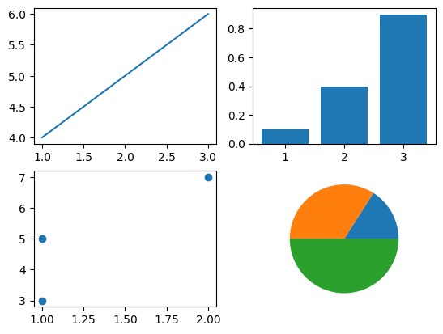
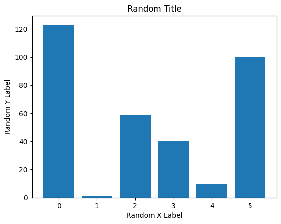
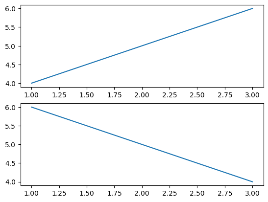
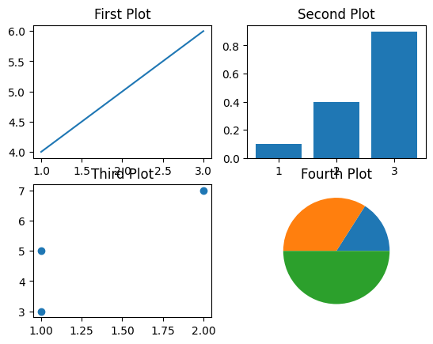
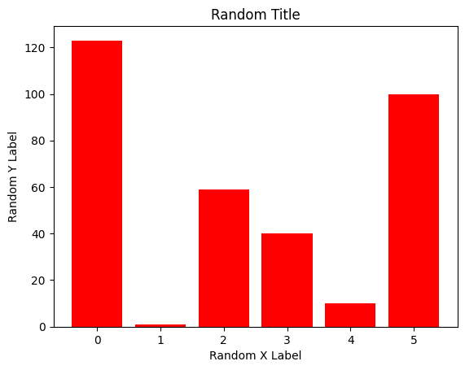
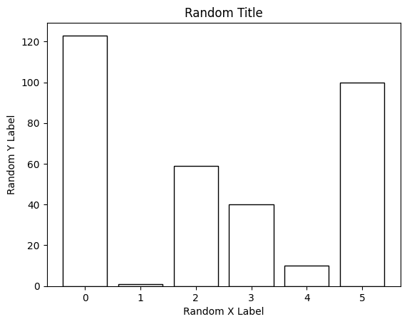
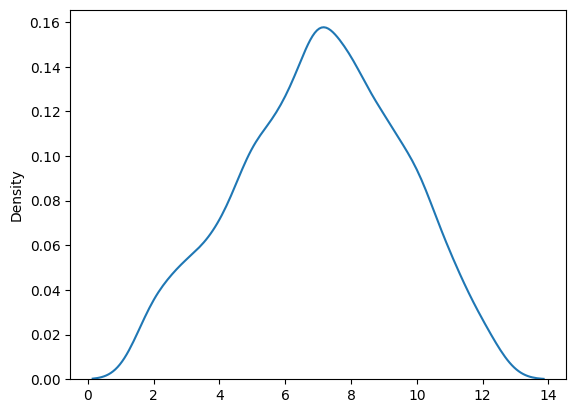
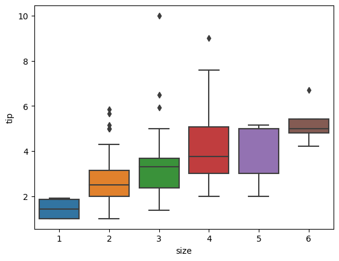
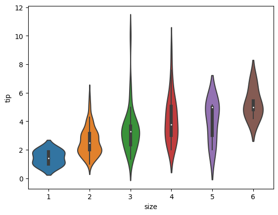
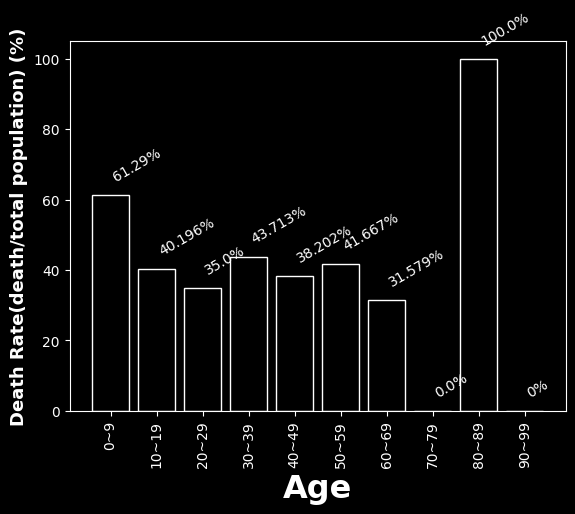

저번에 공부한 `Pandas` 을 다음으로 이번에는 `matplotlib`과 약간의 `seaborn`를 공부하였다. `seaborn`은 부록정도로.
<br><br>
# Week 2: matplotlib & seaborn
`import matplotlib.pyplot`<br>
이번의 예제에는 `import matplotlib.pyplot as plt`가 전제되어있다.

# matplotlib

## 1. .plot() .bar() .scatter() .pie()
특정 형태의 그래프를 그려주는 메소드이다.<br>
```python
plt.plot([1,2,3],[4,5,6])
plt.bar([1,2,3],[0.1,0.4,0.9])
plt.scatter([1,2,1],[3,7,5])
plt.pie([23,49,72])
```
<br>
결과(왼쪽 위부터 시계방향으로 plot, bar, scatter, pie):<br>


* **.plot()** : 선그래프
* **.bar()** : 막대그래프
* **.pie()** : 파이차트
* **.scatter()** : 산점도

<Br><br>

## 2. Plot 꾸미기
### .title() .xlabel() .ylabel()
* .title(*title*) : Plot의 제목을 정한다.
* .xlabel(*xlabel*): x측의 레이블을 지정한다.
* .ylabel(*ylabel*): y측의 레이블을 지정한다.

```python
import matplotlib.pyplot as plt

x = [0, 1, 2, 3, 4, 5]
y = [123, 1, 59, 40, 10, 100]

plt.bar(x,y)
plt.title("Random Title")
plt.xlabel("Random X Label")
plt.ylabel("Random Y Label")
plt.show()
```
결과:<br>

### .subplot() .subplots()
먼저 .subplot()은 여러개의 그래프를 한 화면안에 그리기 위해 사용하는 메소드이다.<br>
`.subplot(row,column,index)`로 사용된다.
```python
import matplotlib.pyplot as plt

plt.subplot(2, 1, 1)
plt.plot([1, 2, 3], [4, 5, 6])
plt.subplot(2, 1, 2)
plt.plot([1, 2, 3], [6, 5, 4])
plt.show()
```
결과:<br>
<br>

이제 .subplot()을 반복적으로 부르면 귀찮으니까 이걸 한번에<br>
`.subplots()`을 사용해서 한번에 만든다.
```python
import matplotlib.pyplot as plt
fig,ax = plt.subplots(nrows=2,ncols=2)

ax[0][0].plot([1,2,3],[4,5,6])
ax[0][0].set_title('First Plot')
ax[0][1].bar([1,2,3],[0.1,0.4,0.9])
ax[0][1].set_title('Second Plot')
ax[1][0].scatter([1,2,1],[3,7,5])
ax[1][0].set_title('Third Plot')
ax[1][1].pie([23,49,72])
ax[1][1].set_title('Fourth Plot')
plt.show()
```
결과:<br>
<Br>
~~(위에서 비슷한거 본거같은데)~~<br>

### 수직선, 수평선, 영역색칠
수직선, 수평선으로는 .axvline(), .axhline()을 사용한다.<br>
`plt.axvline(x,ymin,ymax)`<br>
* x: 수직선의 방정식 x=a에서 a
* ymin, ymax: 0에서 1 사이의 수. plot의 위쪽 끝을 100%, 아래쪽 끝을 0%로 두고 ymin에서 ymax까지 선을 긋는다.

.axhline()도 비슷한 방식으로 사용한다.<br>
.axvpan(), .axhpan()은 영역을 색칠하는데에 이용된다.<br>
둘의 구분은 어떤축을 기준으로 영역을 정할지에 따라 다르다. 기준이 되지 않는 축의 폭은 수직, 수평선을 긋는 메소드와 같이 화면의 전체 가로세로를 100%으로 환산하여 정하는 방법을 사용하게된다.
### 그래프 색 정하기
아까의 그래프 <br>
<br>
에서

```python
plt.bar(x,y)
```

에서

```python
plt.bar(x,y,color='red')
```

으로바꾸면<br>
<br>
그리고 만약 색칠되는게 싫다면
```python
plt.bar(x,y,fill=False)
```
으로 바꾸면
<br><br>
이 된다.
<br><br>

# seabron
`matplotlib`가 구체적이고 정교한 그림을 그릴 수 있다면, `seaborn`은 비교적 빠르고 단순하게 그리고 싶을떄 사용한다고 한다.<br>
```python
import seabron as sns
```
## 1. KDE (Kernel Density Estimator) plot
분포도라고 생각하면 된다.
```python
import matplotlib.pyplot as plt
import seaborn as sns
import random as rand
x=[rand.randint(1,6)+rand.randint(1,6) for i in range(1000)]
sns.kdeplot(x)
plt.show()
```
결과:<br>
<br>
## 2. Boxplot & Violin plot
Boxplot과 Violin plot은 둘다 이상치를 확인할 수 있는 plot이다.<br>
이상치란, 보통 관측된 데이터의 범위에서 많이 벗어난 너무 작은 값이나 큰 값을 말한다. 주로 데이터들의 표준편자를 이용하여 정한다.
```python
import seaborn as sns
tips=sns.load_dataset('tips')
sns.violinplot(x='size',y='tip',data=tips)
plt.show()
```
결과:<br>
<br>

```python
import seaborn as sns
tips=sns.load_dataset('tips')
sns.boxplot(x='size',y='tip',data=tips)
plt.show()
```
결과:
<br>

<br><br><br>
# 과제

```python
import matplotlib.pyplot as plt
import pandas as pd
plt.style.use('dark_background')
dfr=pd.read_csv('./train.csv')
df=dfr[['Age','Survived']].sort_values('Age').dropna()
ndfs=[]
keys=[]
MAXAGE=100
dAge=10
for i in range(MAXAGE//dAge):
    keys.append('{}~{}'.format(i*dAge,(i+1)*dAge-1))
    a=df.query("Age>={} & Age<{}".format(i*dAge,(i+1)*dAge))['Survived']
    if len(a)>0:
        ndfs.append(a.mean()*100)
    else:
        ndfs.append(0)
    plt.annotate('{}%'.format(round(ndfs[i],3)),(keys[i],ndfs[i]+4),rotation=30)
plt.bar(keys,ndfs,fill=False)
plt.xlabel("Age",fontweight='bold',fontsize=23)
plt.ylabel("Death Rate(death/total population) (%)",fontweight='bold',fontsize=13)
plt.xticks(rotation=90)
plt.show()
plt.style.use('default')
```
<br>
나잇대에 따라 사망율을 표현했다.


