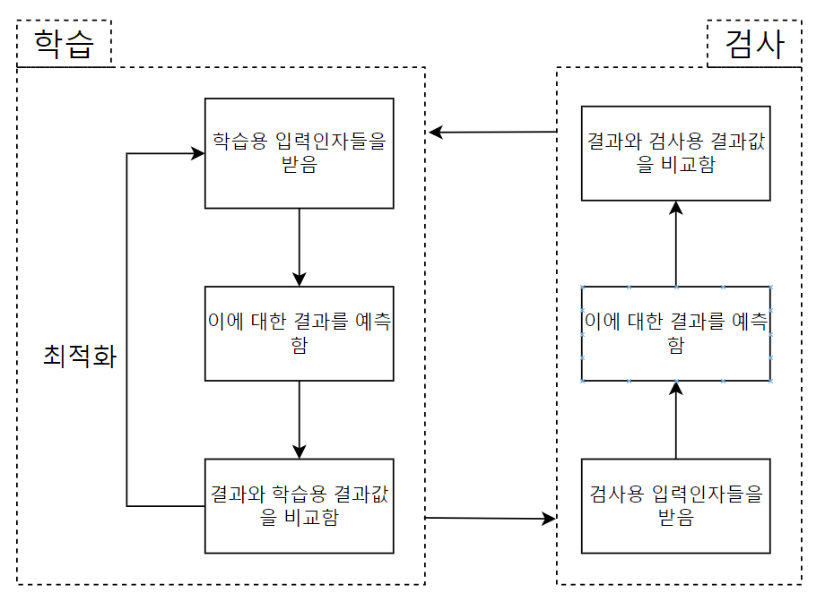

# WIL Week 5

이번에는 scikit-learn(줄여서 sklearn)을 통해 기본적인 ML에 대해 공부하였다.

## 기본적으로
---
ML 기존의 데이터의 특징에 대해 학습한 후, 결과나 대응되는 답을 모르는 상태에서 그 답을 예측하게 하는 것이라고 생각하면 된다. 명제나 공식등을 유추한다고 생각해도 되고, 우리가 시험공부를 할때 공부한 다음 시험을 보는 것과 같다고 할 수 있다.

좀 더 수학적으로 표현하자면 주어진 인자 집합과 대응되는 출력/선택의 관계에 대해 학습한 다음, 결과를 필요로 하는 인자 집합에 대해 그 결과를 예측하는 것이다.

인공지능이 학습할 떄 자신이 유추해 낸 답과 실제 결과를 비교하여 학습을 하는 최적화가 일어나는데, 기본적으로 미분의 개념이 이용된다.

## scikit-learn
---
> Scikit-learn(이전 명칭: scikits.learn, sklearn)은 파이썬 프로그래밍 언어용 자유 소프트웨어 기계 학습 라이브러리이다. - Wikipedia

  

>Scikit-learn is an open source machine learning library that supports supervised and unsupervised learning. - scikit-learn.org

  

scikit-learn은 python에서 머신러닝을 할 떄 널리 쓰이는 라이브러리 이다. <br>`Windows`에서 설치할때는

  

```bash
pip install  sckikit-learn
```

import 할때는

```python
import sklearn
```

  

의 형태로 작동한다.

~~(사실 scikit-learn이랑 sklearn이랑 같이 써서 좀 헤멨다.)~~

## 학습 데이터 준비
---
기본적으로 인공지능을 학습시키고 검사하는 데에 다음과 같은 데이터가 필요하다:

* 학습용 입력인자들

* 학습용 결과값들

* 검사용 입력인자들

* 검사용 결과값들

  



학습용 데이터로 먼저 학습을 하고, 학습용 데이터와는 다른 검사용 데이터를 통해 모델이 주어진 정보들에 대해서 얼마나 정확히 답을 유추하였는지 검사한다.    
이렇게 하는 이유는 검사용 데이터에 대한 과적합을 방지하기 위해서다.   시험공부로 생각해 보자.   
시험공부를 하고 있는데, 시험문제들을 다 알고 있다고 하자. 만약 이 시험문제에 대해서만 공부를 하게 되면, 시험 점수는 좋을것이다. 하지만, 이 사람이 실제로 이 학문에 대한 능력&경험&지식이 늘어났다고 할 수 있을까? 아닐 것이다.   
이와 같다. 만약 모델이 검사용 데이터를 같이 학습하게 되면 검사과정에서 실제 추측을 하기 보다는 검사용 데이터를 특정하여 전반적인 추론 수준에 비해 정확도가 너무 높을 수 있다. 만약 이 높은 검사 결과를 보고 완전히 새로운 데이터에 대해 실전으로 추론해야 한다면? 검사 결과에 미치지 못하는 상황을 만들 가능성이 높다.
> 연습은 실전처럼, 실전은 연습처럼<br>
`sklearn` 에서는 이를 `train_test_split`을 이용한다.

```python
from sklearn.model_selection import train_test_split
# x-> 데이터의 입력인자 목록
# y-> 데이터의 결과값 목록
X_train, X_val, y_train, y_val = train_test_split(X,y,test_size=0.2,random_state=42)

```
* test_size : number
학습용 데이터와 검사용 데이터 간의 비율
* random_state : number
기존 데이터에서 학습용과 검사용을 나눌때 무작위로 뽑는데, 결정론적인 난수이기 때문에 이 난수의 생성을 위한 시드 역할과 유사하다고 생각하면 된다.<br>
이떄
* X_train : 학습용 입력인자들
* y_train : 학습용 결과값들
* X_val : 검사용 입력인자들
* y_val : 검사용 결과값들
위의 코드에서는 총 데이터 중 20%를 검사용 데이터로 분리시키게 된다.<br><br>

## 전처리 ㄱㄱ
---
이제 가장 중요하다는 전처리를 해야 한다.<br>
지금까지 빈 NaN/null값에 대해 처리해 왔다. 그러나 ML모델을 학습시키는데에 있어 중요한 다른 일이 있다 그것은 바로.....<br>
## Scaling
---
쉽게 표현해서 불필요하게 가중치 역할을 하는 요소들을 제거하는 과정이다.<Br>
또한 모델의 최적화 과정에서 안정성을 높이고, 수렴속도를 증가시킨다.
불필요한 가중치는 주로 숫자의 규모의 차이와 이상치 등이 있다. `sklearn`에서는 `fit()`과 `transform()`, 또는 이 둘을 합친 `fit_transform()`등이 있다.<Br>
scaling에서도 종류가 있다.
* StandardScaler : 데이터의 평균을 0, 분산을 1로 만든다.
* MinMaxScaler : 최소, 최대가 각각 0,1이 되도록 만든다.
* MaxAbsScaler : 데이터의 크기의 최대값과 0이 각각 1,0이 되도록 만든다.
* RobustScaler : 데이터의 중앙값을 제거하고, 1분위수를 기준으로 Scaling을 시행한다.
이번에는 `StandardScaler`을 사용해 보자.<Br>
`fit()`은 scaler가 데이터를 학습하도록 하고, `transform()`은 그 학습을 기반으로 scaling을 하게 만드는 메소드이다.<br>

```python
from sklearn.preprocessing import StandardScaler
scaler = StandardScaler()

# X는 데이터
scaled_X=scaler.fit_transform(X)
```
또는

```python
scaler.fit(X)
scaled_X=scaler.transform(X)
```
둘 다 같다. ML용 데이터에 대해서는 학습용 데이터에 대해서 `fit`을 시행한 다음, 검사용 데이터에게 새로 `fit`을 하지 않고 그대로 다시 `transform`을 한다.

```python
scaled_Train=scaler.fit_transform(Train) #fit & transform
scaled_Test=scaler.transform(Test)# transform
```

학습용 데이터를 통해 모델이 학습을 하였기 때문에, 검사용 데이터도 규격을 맞춰 학습용 데이터의 scaling 정보를 그대로 사용해여 scaling을 진행한다.

## Decision Tree Model(의사결정트리 모델)
---
드디어 ML모델을 학습시켜 보자. ML 모델에 종류는 많지만, 이번에는 Decision Tree Model을 사용해 볼 것이다.<br>
Decision Tree Model은 나무가지와 같이 시작지점에서 부터 선택지를 가지를 치듯이 트리구조로 뻗어나간다. 각 노드에서 그다음 층으로 갈때 값들의 대소를 비교한다.<br>
참고로 이러한 특징 때문에 scalingdmf 하지 않는다. Scaling은 단조변환(대소관계가 바뀌지 않음)을 시행하기 때문에 영향을 주지 않는다. 컴퓨터가 숫자를 다루는 방식에 의해 오히려 정보의 손실이 일어날 수 있다고 한다.
훈련시켜보자:

```python
from sklearn.tree import DecisionTreeClassifier
tree_clf = DecisionTreeClassifier()
tree_clf.fit(X_train,y_train) #학습용 데이터로 학습
```

학습... 잘 했을까?<br>
검사하는 방법으로 `sklearn.matrics.accuracy_score`을 사용할 수 있다.<br>
`.predict()`를 통해 검사용 입력인자를 넣어 모델의 출력을 받을 수 있고, 이를 실제 검사용 결과값과 비교하여 정확도를 계산하는 것이다.

```python
from sklearn.metrics import accuracy_score
predictions = tree_clf.predict(X_val)
accuracy = accuracy_score(y_val,predictions)#검사용 결과값과 비교
print(accuracy)
```
출력(예시):
```python
0.9473684210526315
```
<br>

참고로 `matplotlib`과 `sklearn.tree.plot_tree()`를 이용해서 트리를 시각화 할 수 있다.

```python
import matplotlib.pyplot as plt
from sklearn.tree import plot_tree
fig = plt.figure(figsize=(15,8))
plot_tree(tree_clf)
```

결과(예시):<Br>

<br><br><br>
## 다른모델은 어떰? - Random Forest
---
이름에서 유추해 볼 수 있듯이 Random Forest Model은 여러 개의 Decision Tree를 학습하는 모델이다~~(대충 나무가 여러개니 숲이라는 뜻)~~.<Br>
사용 방법은 비슷하다.

```python
from sklearn.ensemble import RandomForestClassifier

rf_clf = RandomForestClassifier()
rf_clf.fit(X_train, y_train)
rf_prediction = rf_clf.predict(X_val)

rf_acc=accuracy_score(y_val, rf_prediction)
print(rf_acc)
```
출력(예시):
```python
0.9473684210526315
```

### **sklearn.ensemble...?**
Random Forest 모델은 앙상블 모델의 한 종류이다.<br>
앙상블 모델은 여러 개의 분류기(classifier)을 만들어 각 분류기의 결과를 총합하여 더 정확한 예측을 유도하는 학습 방법이다. 강한 하나의 모델 보다는 약한 여러개의 모델을 합쳐 강하게 만드는 것을 중심으로 하며, 집단지성의 개념과 비슷하다. 이 때문에 하나의 트리를 사용하는 Decision Tree 모델보다 보통 더 높은 정확성을 보여준다.

# References:
* https://scikit-learn.org/stable/modules/generated/sklearn.model_selection.train_test_split.html
* https://mingtory.tistory.com/140
* https://ko.wikipedia.org/wiki/%EB%9E%9C%EB%8D%A4_%ED%8F%AC%EB%A0%88%EC%8A%A4%ED%8A%B8
* https://rfriend.tistory.com/749
* https://forecastegy.com/posts/do-decision-trees-need-feature-scaling-or-normalization/
* https://stackoverflow.com/questions/43675665/when-scale-the-data-why-the-train-dataset-use-fit-and-transform-but-the-te
* https://www.analyticsvidhya.com/blog/2020/05/decision-tree-vs-random-forest-algorithm/#Why_Did_Our_Random_Forest_Model_Outperform_the_Decision_Tree?
* https://www.analyticsvidhya.com/blog/2021/06/understanding-random-forest/
* http://www.dinnopartners.com/__trashed-4/