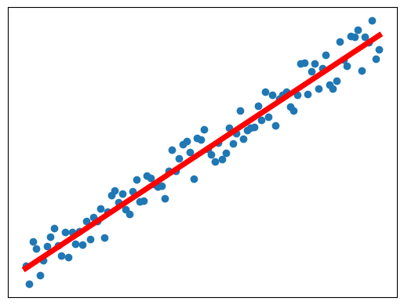
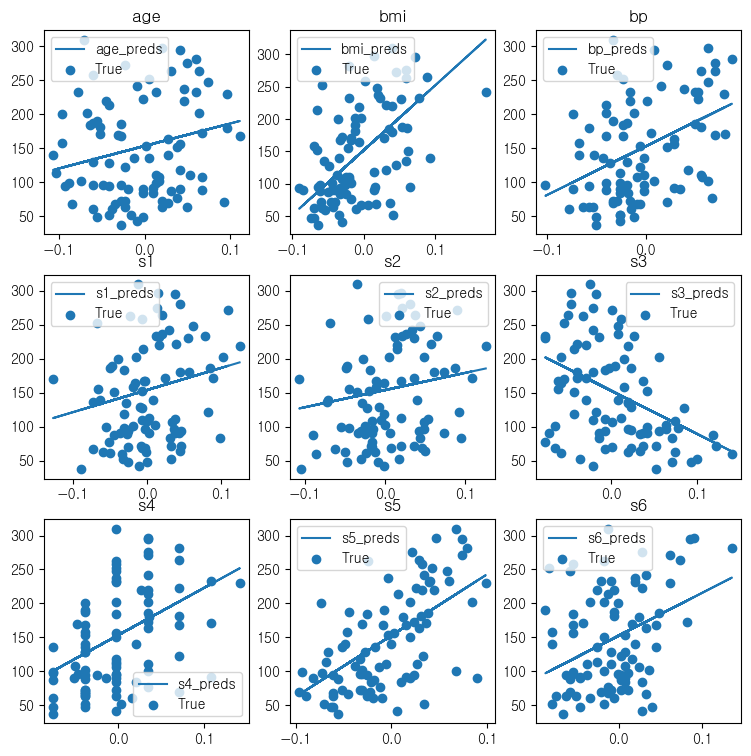
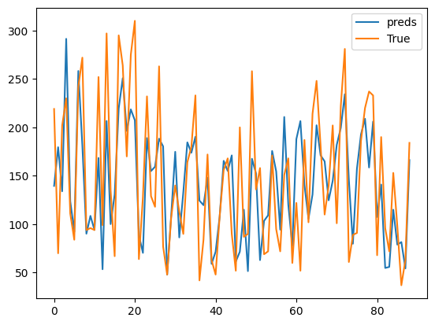
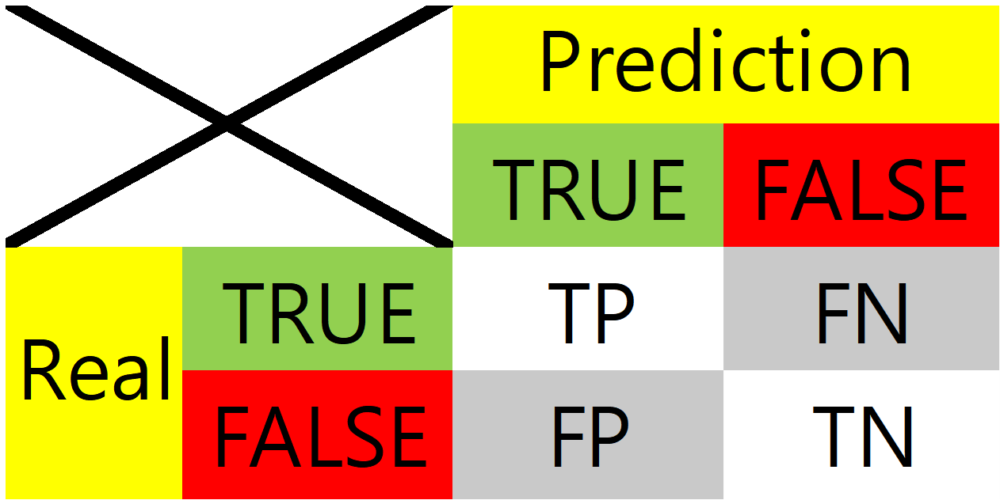
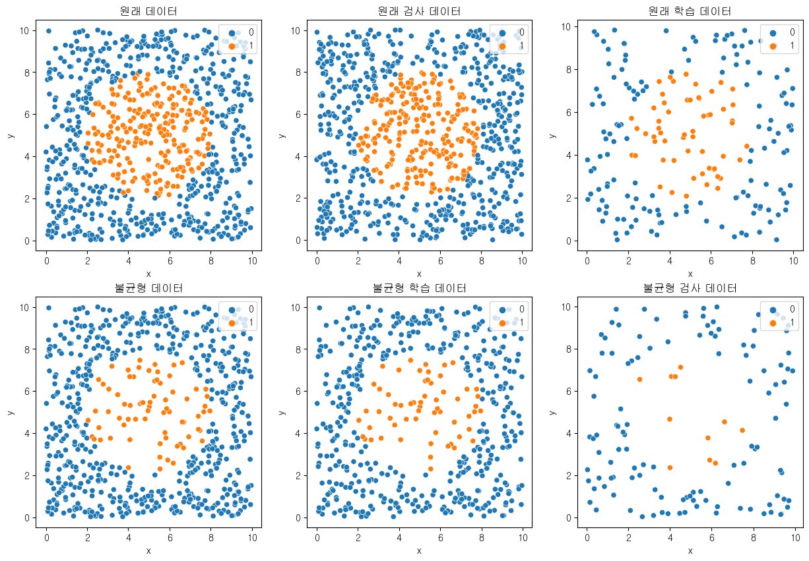
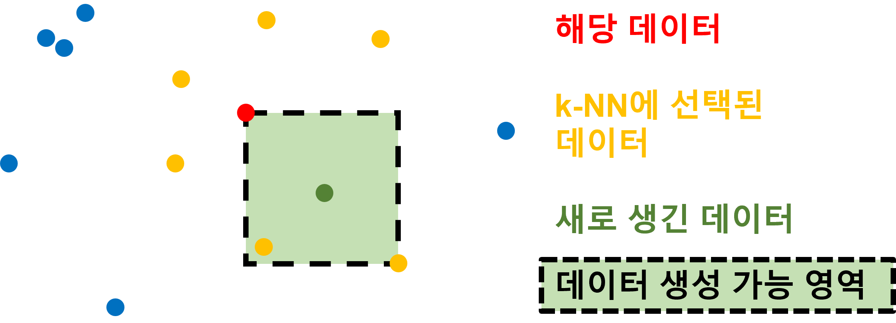
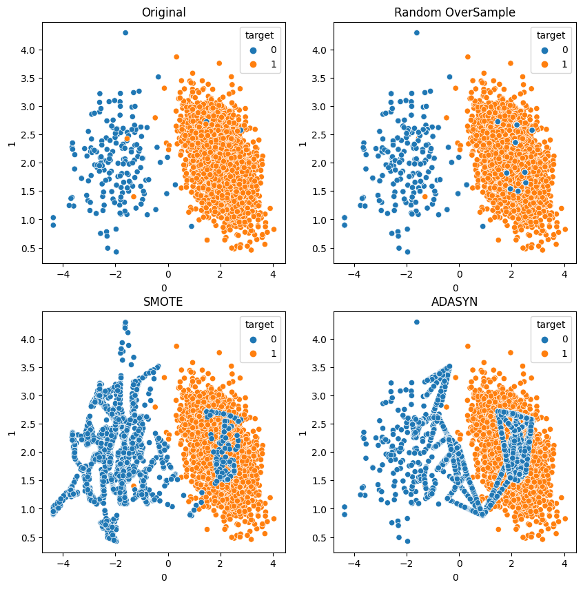
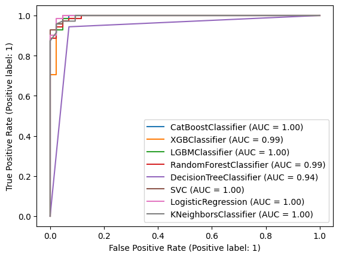
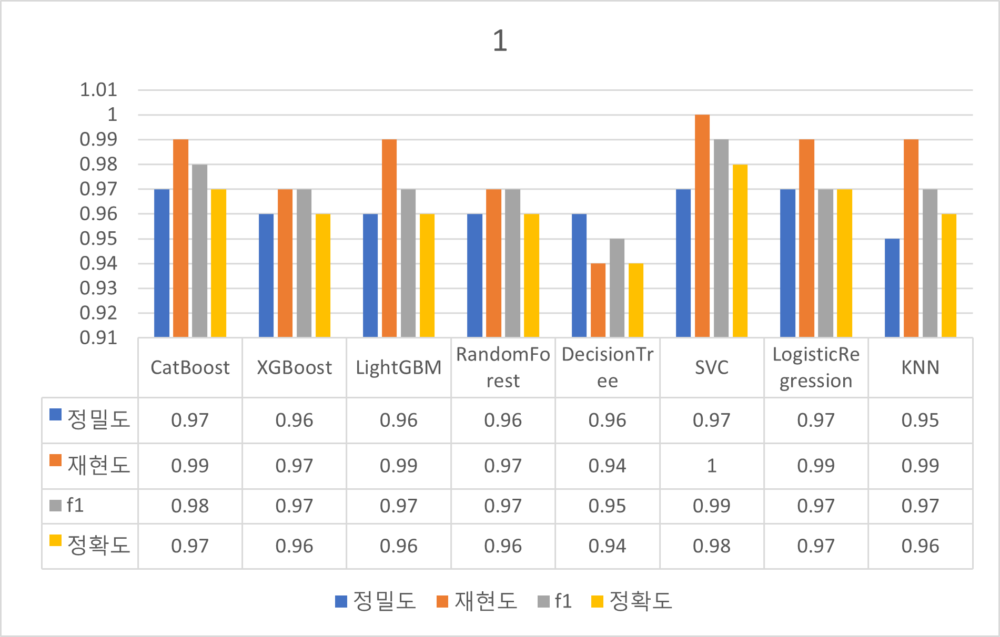

# WIL Week 6
이번에는 다음에 대해 공부하였다:
* 지도학습
* 분류 & 분류 평가 지표
* 회귀 & 회귀 평가 지표
* 데이터 불균형
# 지도학습과 비지도 학습
ML은 크게 어떻게 학습할 것이냐에 따라 지도학습과 비지도 학습으로 나누어 진다.
## 지도학습
지도학습은 쉽게 말하면 이전의 문제와 답지를 주고, 새로운 문제를 해결하라는 것이다. 용어로는 독립변수와 종속변수로 각각 부른다.    
크게 회귀와 분류로 나뉜다
## 그전에...
양적 데이터 : 간단히 말해 숫자. "얼마나"의 의미를 가진다고 생각하면 된다.   
Ex) 키(**얼마나** 큰지), 기온(**얼마나** 더운지), 시간(**얼마나** 오래되었는지)   
범주형 데이터 : 범주, 범위 등 데이터들을 분류시키는 기준과 그 분류된 데이터들이라고 생각하면 된다. 선택지로써 존재하는 경우가 많다.
Ex) 과목, 곤충, MBTI
### **회귀**
회귀는 데이터들을 통해 양적인 정보를 추측하는 지도학습 방법中 하나이다.   
독립변수와 종속변수간에 어떠한 관계가 있고, 그 관계를 모델이 학습하여 새로운 독립변수에 대해 종속변수를 예측하는 것이다.  
대부분의 경우에 독립변수와 종속변수간에 선형적인 관계가 있다고 가정하고 선형 회귀를 가장 많이 사용한다.   
Ex) 공부한 시간에 대한 성적(이산적인 경우가 좀 있지만)
### **분류**
분류는 데이터들을 통해 범주형 정보를 추측하는 지도학습 방법中 하나이다.   
독립변수들을 통해 종속변수를 정해진 기준에 따라 분류시키는 것이다.
# 회귀 
회귀 중 이번에는 가장 기본적이면서 널리 쓰이는 선형회귀에 대해 정리해 보자.   
선형회귀 모델은 기본적으로 독립변수 x와 종속변수 y에 대해 다음과 같은 관계
$$
\large{y=Wx+b}
$$
를 가진다고 가정하고, 가장 적합한 W와 b를 찾는 모델이라고 생각하면 된다.   
보통 위 관계식에서 W를 가중치(weight), b를 편향(bias)라고 한다.<br><br>
   
쉽게 말해 데이터의 경향을 가장 잘 나타내는 하나의 직선을 찾는 것이다.   
읽으면 "잘 나타내는"의 기준이 모호하게 느껴질 것이다. 이제 어떤 모델을 사용할 지에 있어서 이 기준을 직접 정하는 것이다.   
이번에 실제로 사용해 볼 것은 `sklearn`의 `LinearRegression` 이다.
~~(역시 sklearn은 뭐든지 다 있다)~~

```python
from sklearn.linear_model import LinearRegression
```

수학적으로
> LinearRegression fits a linear model with coefficients w = (w1, …, wp) to minimize the residual sum of squares between the observed targets in the dataset, and the targets predicted by the linear approximation.<br>-[scikit-learn.org](https://scikit-learn.org/) 中 [LinearRegression](https://scikit-learn.org/stable/modules/generated/sklearn.linear_model.LinearRegression.html)에 대한 설명

회귀모델과 실제 데이터의 RSS(Residual Sum of squares)가 최소가 되도록 한다.   
쉽게 말해 예측한 결과값과 실제 결과값 간의 편차 제곱의 합을 최소화 시키는 것을 목적으로 하는 것이다.   
이번에 사용할 데이터는 `sklearn`의 당뇨병 데이터이다.
```python
from sklearn.datasets import load_diabetes
```
이 당뇨병 데이터에는 독립변수로 6가지 요인과 종속변수로 당뇨의 진행도를 가지고 있다. 일단 한번 각 독립변수에 대해 1개씩 선형회귀를 해 보자(성별은 범주적이고, 그림의 가시성을 위해 성별을 통한 회귀 분석은 제외하였다).
```python
import pandas as pd
from sklearn.datasets import load_diabetes
from sklearn.linear_model import LinearRegression
from sklearn.model_selection import train_test_split
import matplotlib.pyplot as plt

X, y = load_diabetes(return_X_y=True,as_frame=1)
X.drop("sex",axis=1,inplace=True)
occ=X.columns.array
fig,ax=plt.subplots(3,3,figsize=(9,9))
for i,col in enumerate(occ):
    Xf=X[col].array[:,np.newaxis]
    X_train, X_val, y_train, y_val = train_test_split(
        Xf, y, test_size=0.2, random_state=42)
    reg = LinearRegression()
    reg.fit(X_train, y_train)
    preds = reg.predict(X_val)
    ypos=i//3
    xpos=i%3
    ax[ypos][xpos].plot(X_val, preds, label="{}_preds".format(col))
    ax[ypos][xpos].scatter(X_val, y_val, label="True")
    ax[ypos][xpos].set_title(col)
    ax[ypos][xpos].legend()
plt.show()
```
결과:   
   
아니면 여러 요소들을 한번에 다 포함시킬 수 있다
```python
import pandas as pd
from sklearn.datasets import load_diabetes
from sklearn.linear_model import LinearRegression
from sklearn.model_selection import train_test_split

import matplotlib.pyplot as plt

X, y = load_diabetes(return_X_y=True, as_frame=True)
dataset = pd.concat([X, y], axis=1)

X_train, X_val, y_train, y_val = train_test_split(
    X, y, test_size=0.2, random_state=42)

reg = LinearRegression()
reg.fit(X_train, y_train)
preds = reg.predict(X_val)

plt.plot(range(len(y_val)), preds, label="preds")
plt.plot(range(len(y_val)), y_val, label="True")
plt.legend()
plt.show()
```
결과 : (2차원 이상의 독립변수에 종속되어있으므로 한 독립변수에 대해서만 선형관계를 시각화하기에는 힘들다. 대신 각 데이터 행마다 실제 종속변수와 예측값을 비교하였다)   

## 회귀 - 어떤게 좋은 결과일까?
이렇게 학습된 모델이 얼마나 예측을 잘 하는지는 어떤 지표를 통해 비교해야 할까?    
회귀에는 주로 관측값, 관측값의 평균, 그리고 추정값을 이용하여 계산한다. 다음과 같은 지표가 있다 :    
* MAE : 오차/잔차 절댓값의 평균
* MSE : 오차/잔차 제곱의 평균
* RMSE :오차/잔차 제곱의 평균의 제곱근. $\sqrt{MSE}$
* $R^2$ : 결정 계수.   

### **오차? 잔차?**
둘다 기본적으로 선형 회귀 모델의 추정값과 실제 관측값의 차이를 의미한다. 오차는 모집단을 통해 회귀선을 얻었을 때, 잔차는 표본집단으로 얻었을 때 사용하는 용어라고 한다.   <br><br>
### **결정 계수???????????????????**
$$\large{R^2~=~\frac{SSE}{SST}}$$
SSE는 추정값과 관측값 평균의 차이의 제곱의 합이고,   
SST는 관측값과 관측값 평균의 차이의 제곱의 합이다.   
즉 관측값들 $y_i (i=0,1,...,n)$에서 관측값의 평균 $\overline{y}$, 추정값 $\hat{y_i}$에 대해
$$\large{SST=\sum^{n}_{i=0}{(y_i-\overline{y})^2}},~~SSE=\sum_{i=0}^{n}{(\hat{y_i}-\overline{y})^2}$$    
의미적으로는 종속변수의 분산에 대해 독립변수가 얼마나 설명할 수 있는지를 표현한 것으로, 1에 가까울수록 좋은 모델이라고 생각할 수 있다. 그러나 사실 별 상관없는 두 변수간에 우연적으로 $R^2$가 높게 나오는 허구적 회귀가 일어나는 상황도 있다.
## 한번 구해보자!
`sklearn`에서 관련된 함수를 다 제공해 준다.
```python
from sklearn.metrics import mean_absolute_error
from sklearn.metrics import mean_squared_error
from sklearn.metrics import r2_score
# preds : 추정값
# y_val : 검사용 데이터 (=관측값)
print("MAE : ",mean_absolute_error(preds,y_val))
print("MSE : ",mean_squared_error(preds,y_val))
print("RMSE : ",mean_squared_error(preds,y_val,squared=False))
print("R2 : ",mean_absolute_error(preds,y_val))
```
결과:
```
MAE :  42.79409467959994
MSE :  2900.193628493481
RMSE :  53.85344583676592
R2 :  42.79409467959994
```   

# 분류
저번 시간에 `Decision Tree`와 `Random Forest` 모델로 기본적인 분류를 이미 해 보았다. 이번에는 모델이 얼마나 "제대로" 평가할 수 있는지 파악해 보도록 하자.
## 분류 - 어떤게 좋은 결과일까?
저번에 분류를 공부하였을때는 정확도만을 사용하여 평가하였다. 하지만 target이 어느 한쪽으로 치우쳐져 있다면 정확도의 가치는 점점 무의미해진다 : 얼마 없는 Target에 대한 데이터는 평가하는데에 있어 모델이 실수할 가능성이 높아진다. 이 때문에 정확도뿐만이 아닌 다른 기준도 있어야 다양한 상황에서 전반적으로 어떤 모델이 좋을지 적절히 비교할 수 있다.
이를 위해서...
## Classification Metrics (분류 평가 지표)
<Br><figcaption align="center">**Confusion Matrix (혼동 행렬)**</figcaption>
분류모델의 성능을 시각화 하는데에 도움을 주는 표이다.   
* TP(True Positive) : 참이라고 예측하고, 실제로도 참임(즉 예측이 맞았다 = True)
* FN(False Negative) : 거짓이라고 예측하고, 실제로는 참임(즉 예측이 틀렸다 = False)
* FP(False Positive) : 참이라고 예측하고, 실제로는 거짓임
* TN(True Negative) : 거짓이라고 예측하고, 실제로도 거짓임 <Br><br>  

이를 통해서 분류모델을 평가하는 지표를 구하게 된다 :<Br>

* Accuracy(정확도) : $\Large{\frac{TP+TN}{TP+FP+TN+FN}~=~\frac{T}{All}}$   
  + "예측 중 정답인 예측의 비율"
  + 1에 가까울수록 좋다고 평가
  + 불균형한 분류 결과의 분표에 따라 정확도만으로 평가하기는 어려워진다.
* Precision(정밀도) : $\Large{\frac{TP}{TP+FP}~=~\frac{TP}{Prediction~True}}$
  + "참이라고 예측한 데이터 중 실제로 참인 데이터의 비율"
  + 1에 가까울수록 좋다고 평가
  + 1에 가까울수록 참이라고 예측한 데이터들은 모두 실제로 참일 확률이 높음
* Recall(재현도) = Sensitivity(민감도) : $\Large{\frac{TP}{TP+FN}~=~\frac{TP}{Real~True}}$
  + "실제로 참인 데이터 중 참으로 예측된 데이터의 비율"
  + 1에 가까울수록 좋다고 평가
  + 1에 가까울수록 실제로 참인 데이터들을 놓칠 확률이 작음
* F1 Score : $\Large{\frac{2}{\frac{1}{Precision} + \frac{1}{Recall}}~=~\frac{2~\times~Precision~\times~Recall}{Precision~+~Recall}}$   
  + 정밀도와 재현도의 조화평균으로 계산한다
  + 1에 가까울수록 좋다고 평가
  + 조화평균을 사용한 이유는 정밀도와 재현도중 작은 값이 있다면 그 값이 총 f1에 더 큰 영향( 더 민감하게 감지하도록) 하기 위해서이다   

복잡해 보이는 거는 당연하다. 한번 실제로 확인해보자
다음과 같은 데이터를 준비했다:
* 독립변수로는 2차원 좌표 (x,y) ${(0 \le x,y \lt 10)}$ 가 주어진다.
* 종속변수로는 (x,y)에서 (5,5) 까지의 유클리드 거리가 3 미만이라면 1, 아니면 0을 가진다.

이제 이 데이터에서 종속변수가 1인 걸 줄여서 불균형 데이터를 만들자.


    
이제 이 두 데이터를 통해서 분류 모델을 학습시켜보고, 분류 평가 지표를 확인하여 보자. 이번에는 `Random Forest` 모델을 사용하였다. 데이터를 위한 난수로는 `random` 모듈의 `uniform()`을 사용하였다.

```python
from random import uniform
from sklearn.ensemble import RandomForestClassifier
from sklearn.metrics import classification_report
```

`sklearn`의 `clasification_report`를 사용하면 분류 모델의 정밀도, 재현도, f1 점수, 정확도와 함께 다른 정보들 또한 알려준다.<Br><br>
```python
# 1000 item
# X : Array of uniformly random 2D points
# y : target
# data : concat of X and y. Total data with both independent & dependent variables.
# data는 원래 데이터
X_train,X_val,y_train,y_val = train_test_split(X,y,test_size=0.2,random_state=32)
classifier1=RandomForestClassifier()
classifier1.fit(X_train,y_train)
preds=classifier1.predict(X_val)
print(classification_report(preds,y_val))
```

결과:   
```
              precision    recall  f1-score   support

           0       0.98      0.96      0.97       139
           1       0.92      0.95      0.94        61

    accuracy                           0.96       200
   macro avg       0.95      0.96      0.95       200
weighted avg       0.96      0.96      0.96       200
```
이번에는 원래 데이터로 부터 불균형한 데이터를 만들고, 이를 통해 분류 모델을 학습시켜 보자.

```python
temp=data[data['target']==0] #원래 data에서 target이 0인 데이터만 분리
temp2=data[data['target']==1].sample(0.3) #원래 data에서 target이 1인 데이터를 골라, 이 중에서 무작위로 30%만 남겼다.
itrain=pd.concat([temp,temp2]) #위 두 과정을 거친 DataFrame을 합쳐 의도적으로 target=1인 데이터의 수를 줄였다.

iX_train,iX_val,iy_train,iy_val=train_test_split(itrain.drop(['target'],axis=1),itrain['target'],test_size=0.2,random_state=23)

classifier2=RandomForestClassifier()
classifier2.fit(iX_train,iy_train)
preds=classifier2.predict(X_val)
print(classification_report(preds,y_val))
```

결과:
```
              precision    recall  f1-score   support

           0       0.97      0.99      0.98       142
           1       0.93      0.74      0.82        19

    accuracy                           0.96       161
   macro avg       0.95      0.86      0.90       161
weighted avg       0.96      0.96      0.96       161
```

두 경우의 분류 지표를 같이 놓고 보자.   
   
정확도만 놓고 보았을 때는 두 상황 모두 차이가 없다. 하지만 데이터가 불균형할 경우에 재현도 부문에서 값이 크게 떨어진 것을 볼 수 있다. 또 이에 의해 f1도 원래 데이터에 비해 작게 나왔다.
# 불균형 데이터의 보완
위 실험에서 봤지만, 종속변수가 불균형한 데이터의 경우에 모델이 원하는 만큼의 성능을 내지 못하는 것 같다. 그렇다면 균형을 맞추려면 어떻게 해야 할까?   
(다수 데이터를 MD, 소수 데이터를 mD라 하자)
## 없애자! - Undersampling
MD가 mD에 비해 많으니까, MD의 크기를 mD와 비슷하게 줄이는 것이다.   
하지만 문제는 결국 없애는 데이터도 모델이 학습할 수 있을만한 데이터라는 것이다. 그래서 Undersampling의 경우 차라리 시행하기 전의 불균형 데이터의 성능이 더 좋은 경우가 있다.
## 만들자! - Oversampling
~~...예?~~   
mD를 MD와 크기가 비슷해지게 새로운 데이터를 만드는 것이다. 문제는 기존의 데이터에서 나온 데이터이기 때문에 학습 데이터의 mD에 과적합이 일어나 검사 과정에서 제 성능을 발휘하지 못할 수 있다.
새로운 데이터로 무작위로 뽑는다면 안 만드니만 못할 것이다. 그렇다면, 이미 알고 있는 mD를 활용해서 의미있는 데이터를 만들어야 할텐데 어떤 알고리즘이 가능할까?
k-NN 알고리즘을 사용하는 SMOTE, ADASYN등이 있다.
### **k-NN Algorithm**
k-NN 알고리즘은 한 데이터로부터 k개의 인접한 데이터를 참조하여 분류해 주는 알고리즘이다. 이때 "거리"를 측정할 때 n개의 특성에 대해서 n차원 유클리드 거리를 사용한다.
$$\large{d_{A,B}=\sqrt{\sum_{i=1}^{n}{(A_i - B_i)^2}}}$$
## 1. **SMOTE**
**S**ynthetic **M**inority **O**ver-sampling **Te**chnique   
쉽게 말해 기존의 mD들 끼리 그 두 데이터 사이에 새로운 데이터를 만드는 것이다.
알고리즘을 더 자세히 알아보자:
Input:
  - T : mD의 크기
  - N : 원 mD의 데이터 크기에 대한 SMOTE로 만들어질 데이터 개수에 대한 비율
  - k : 근방 데이터 갯수
Output:
  N/100*T 개의 새로운 데이터(mD)
Algorithm:
 기본적으로 k-NN알고리즘을 사용한다.
```
synthetic :=[]
mD 섞기
만약 N<100이면:
  T=(N/100)*T
  N=100
mD안의 각 데이터 mdat에 대해:
  nnarray:=mD에서 mdata에 가장 가까운 k개의 데이터
  p := N
  p가 N과 같지 않을 동안:
    ndata:=nnarray에서 하나 고른 데이터
    ndata := nn번째 mD 데이터
    newdata := 새로운 데이터
    각 데이터의 독립변수 attr에 대해:
      dif := ndata.attr-mdata.attr
      gap := 0~1 사이의 임의의 실수
      newdata.attr = mdata.attr + dif*gap
      synthetic <-push- newdata
    p--
return synthetic
```
더 쉽게   
임의의 두 mD를 고르고, 두 데이터의 각 열에 대해 두 값 사이 중 임의의 지점을 새로운 데이터의 값으로 정하는 것이다.
   
(즉 새 데이터의 각 열의 값은 기존의 두 데이터를 해당 열의 값에 대해 내분하는 점이다.)
## 2. **ADASYN**
**Ada**ptive **Syn**thetic Sampling
알고리즘:
Input:
 - ms : mD의 크기
 - ml : MD의 크기
 - dth : 임계 균형도(불균형인지 아닌지로 판단할 기준)
 - beta : 생성 후 불균형도(0~1, 알고리즘 참고)
```
  ms = mD의 개수
  ml = MD의 개수
  d := ms/ml (균형의 정도)
  만약 d< dth 이라면: 
    G := (ml-ms)*beta (생성할 데이터 수 계산)
    mD의 각 xi에 대해:
      kdat := 전체 데이터에 대해서 k-NN을 시행한다.
      ri := kdat에서 mD에 속하는 데이터의 비율 (0~1)
    모든 ri 정규화 => rhi (밀도분포로 변함)
    mD의 각 xi에 대해:
      gi=rhi * G (i번째에 만들에질 데이터 갯수)
      (이제 SMOTE와 같은 방식으로 데이터를 만든다)
      gi번 반복:
        xz := kdat 중에서 mD에 속하는 무작위로 선발된 데이터
        s := 새 데이터
        각 i번째 열에 대해:
          lambda := 0~1의 난수
          s[i]=xi[i]+(xz[i]-xi[i])*lambda
```
전반적인 생성 과정은 SMOTE와 유사하다. 하지만 SMOTE는 mD 내에서는 가중치를 두지 않지만, ADASYN은 주변에 MD가 많을수록 더 큰 가중치를 가져 더 많은 데이터를 생성하는 기준이 된다.<br><Br>
## 해보자 2트
SMOTE, ADASYN 모두 RandomOverSampler과 함께 `imblearn`이 제공해준다.

```python
import pandas as pd
from collections import Counter
import seaborn as sns
import matplotlib.pyplot as plt
from sklearn.datasets import make_classification
from imblearn.over_sampling import ADASYN, SMOTE, RandomOverSampler
rndd =42
X, y = make_classification(n_classes=2, class_sep=2,
weights=[0.06, 0.94],  n_features=2,n_redundant=0,n_informative=2,n_repeated=0,n_samples=3000,
random_state=rndd,n_clusters_per_class=1)
fig,ax=plt.subplots(2,2,figsize=(10,10))
print('Original dataset shape %s' % Counter(y))
rnd = RandomOverSampler(random_state=rndd)
X_rres, y_rres = rnd.fit_resample(X, y)
print('Random %s' % Counter(y_rres))
smt = SMOTE(random_state=rndd)
X_sres, y_sres = smt.fit_resample(X, y)
print('SMOTE %s' % Counter(y_sres))
ada = ADASYN(random_state=rndd)
X_ares, y_ares = ada.fit_resample(X, y)
print('ADASYN %s' % Counter(y_ares))
X,X_rres,X_sres,X_ares=list(map(pd.DataFrame,[X,X_rres,X_sres,X_ares]))
y,y_rres,y_sres,y_ares = list(map(lambda x: pd.DataFrame(x,columns=['target']),[y,y_rres,y_sres,y_ares]))
sns.scatterplot(x=0,y=1,data=pd.DataFrame(pd.concat([X, y],axis=1)),hue='target',ax=ax[0][0])
sns.scatterplot(x=0,y=1,data=pd.DataFrame(pd.concat([X_rres, y_rres],axis=1)),hue='target',ax=ax[0][1])
sns.scatterplot(x=0,y=1,data=pd.DataFrame(pd.concat([X_sres, y_sres],axis=1)),hue='target',ax=ax[1][0])
sns.scatterplot(x=0,y=1,data=pd.DataFrame(pd.concat([X_ares, y_ares],axis=1)),hue='target',ax=ax[1][1])
ax[0][0].set_title("Original")
ax[0][1].set_title("Random OverSample")
ax[1][0].set_title("SMOTE")
ax[1][1].set_title("ADASYN")
```
결과:
```
Original dataset shape Counter({1: 2813, 0: 187})
Random Counter({1: 2813, 0: 2813})
SMOTE Counter({1: 2813, 0: 2813})
ADASYN Counter({0: 2820, 1: 2813})
```
   
확실히 SMOTE와 ADASYN을 비교하였을때 ADASYN에서 생성된 데이터들이 MD에 몰려있는 것으로 보아 가중치의 존재를 볼 수 있다.   
~~(그리고 polygon스러운 모습들도)~~
# 다른 모델들 둘러보기
~~(남은 시간이 얼마 없어서 설명은 생략 ㅎㅎ)~~
분류에 사용할 수 있는 모델들이 많아 다음 모델들을 서로 비교해 보기로 했다:
- CatBoost
- XGBoost
- LightGBM
- SVC
- Logistic Regression
- KNN Classifier   

이들을 저번에 공부한 `RandomForest`와 `DecisionTree`의 성능과 비교해 보기로 했다. 데이터로는 `sklearn`의 유방암 데이터로 했다.   
비교는 Classification Metrics와 ROC-AUC를 보기로 했다.
```python
import pandas as pd

from catboost import CatBoostClassifier
from xgboost import XGBClassifier
from lightgbm import LGBMClassifier
from sklearn.ensemble import RandomForestClassifier
from sklearn.tree import DecisionTreeClassifier
from sklearn.svm import SVC
from sklearn.linear_model import LogisticRegression
from sklearn.neighbors import KNeighborsClassifier

from sklearn.datasets import load_breast_cancer
from sklearn.model_selection import train_test_split
from sklearn.preprocessing import StandardScaler
from sklearn.metrics import classification_report
from sklearn.metrics import RocCurveDisplay
X, y = load_breast_cancer(return_X_y=True, as_frame=True)
data = pd.concat([X, y], axis=1)
X_train, X_val, y_train, y_val = train_test_split(
    X, y, test_size=0.2, random_state=42)
scaler = StandardScaler()

X_train = scaler.fit_transform(X_train)
X_val = scaler.transform(X_val)

cat = CatBoostClassifier()
xg = XGBClassifier()
light = LGBMClassifier()
rforest=RandomForestClassifier()
deci=DecisionTreeClassifier()
svc=SVC()
loreg=LogisticRegression()
knn=KNeighborsClassifier(n_neighbors=40)

cat.fit(X_train, y_train,silent=True)
xg.fit(X_train, y_train)
light.fit(X_train, y_train)
rforest.fit(X_train, y_train)
deci.fit(X_train, y_train)
svc.fit(X_train, y_train)
loreg.fit(X_train, y_train)
knn.fit(X_train, y_train)

for i in [cat, xg, light,rforest,deci,svc,loreg,knn]:
    preds = i.predict(X_val)
    print(classification_report( y_val,preds))
    svc_disp = RocCurveDisplay.from_estimator(i, X_val, y_val)
```
결과:
```
              precision    recall  f1-score   support

           0       0.98      0.95      0.96        43
           1       0.97      0.99      0.98        71

    accuracy                           0.97       114
   macro avg       0.97      0.97      0.97       114
weighted avg       0.97      0.97      0.97       114

              precision    recall  f1-score   support

           0       0.95      0.93      0.94        43
           1       0.96      0.97      0.97        71

    accuracy                           0.96       114
.....(그냥 표로 정리하겠다)
```



~~(SVC 대다내\~\~\~\~)~~
# 참고문헌
- 지도학습   
  + https://opentutorials.org/course/4548/28945    
- 비지도학습  
  + https://jjong-ga.tistory.com/43   
- 평가지표   
  + https://statinknu.tistory.com/35   
  + https://ko.wikipedia.org/wiki/%EC%88%98%EC%8B%A0%EC%9E%90_%EC%A1%B0%EC%9E%91_%ED%8A%B9%EC%84%B1   
  + https://ko.wikipedia.org/wiki/%EB%AF%BC%EA%B0%90%EB%8F%84%EC%99%80_%ED%8A%B9%EC%9D%B4%EB%8F%84   
  + https://m.blog.naver.com/PostView.naver?isHttpsRedirect=true&blogId=qbxlvnf11&logNo=221522054847   
  + https://m.blog.naver.com/shoutjoy/221788358670   
- SMOTE, ADASYN   
  + http://www.incodom.kr/SMOTE   
  + https://datascienceschool.net/03%20machine%20learning/14.02%20%EB%B9%84%EB%8C%80%EC%B9%AD%20%EB%8D%B0%EC%9D%B4%ED%84%B0%20%EB%AC%B8%EC%A0%9C.html   
  + https://givitallugot.github.io/articles/2021-07/Python-imbalanced-sampling-copy   
  + https://ieeexplore.ieee.org/abstract/document/4633969   
  + https://www.jair.org/index.php/jair/article/view/10302   
  + https://sci2s.ugr.es/keel/pdf/algorithm/congreso/2008-He-ieee.pdf   
  + https://imbalanced-learn.org/stable/over_sampling.html#smote-adasyn   
  + https://hwi-doc.tistory.com/entry/%EC%96%B8%EB%8D%94-%EC%83%98%ED%94%8C%EB%A7%81Undersampling%EA%B3%BC-%EC%98%A4%EB%B2%84-%EC%83%98%ED%94%8C%EB%A7%81Oversampling
- MSE, MAE, RMSE, $R^2$   
  + https://steadiness-193.tistory.com/277  
  + https://www.indeed.com/career-advice/career-development/how-to-calculate-coefficient-of-determination   
  + https://www.indeed.com/career-advice/career-development/correlation-definition-and-examples   
  + https://signature95.tistory.com/49   
  + https://bskyvision.com/entry/%EC%98%A4%EC%B0%A8error%EC%99%80-%EC%9E%94%EC%B0%A8residual%EC%9D%98-%EC%B0%A8%EC%9D%B4   
  + https://agronomy4future.org/?p=2295   
  + https://m.blog.naver.com/tlrror9496/222055889079
  + https://0ver-grow.tistory.com/1145
- Linear Regression
  + https://scikit-learn.org/stable/modules/linear_model.html   
  + https://scikit-learn.org/stable/modules/generated/sklearn.linear_model.LinearRegression.html   
  + https://rebro.kr/185
  + https://wiserloner.tistory.com/1011

- Additional Modules
  +  https://blog.naver.com/PostView.nhn?blogId=gustn3964&logNo=221431714122
  + https://julie-tech.tistory.com/119
  + https://for-my-wealthy-life.tistory.com/24
  + https://towardsdatascience.com/top-machine-learning-algorithms-for-classification-2197870ff501
  + https://velog.io/@gayeon/%EB%8D%B0%EC%9D%B4%ED%84%B0-%EB%B6%84%EC%84%9D-%EC%B4%88%EB%B3%B4%EC%9E%90%EB%A5%BC-%EC%9C%84%ED%95%9C-Logistic-Regression-with-Scikit-Learn
  + https://scikit-learn.org/stable/modules/generated/sklearn.neighbors.KNeighborsClassifier.html
  + https://en.wikipedia.org/wiki/CatBoost